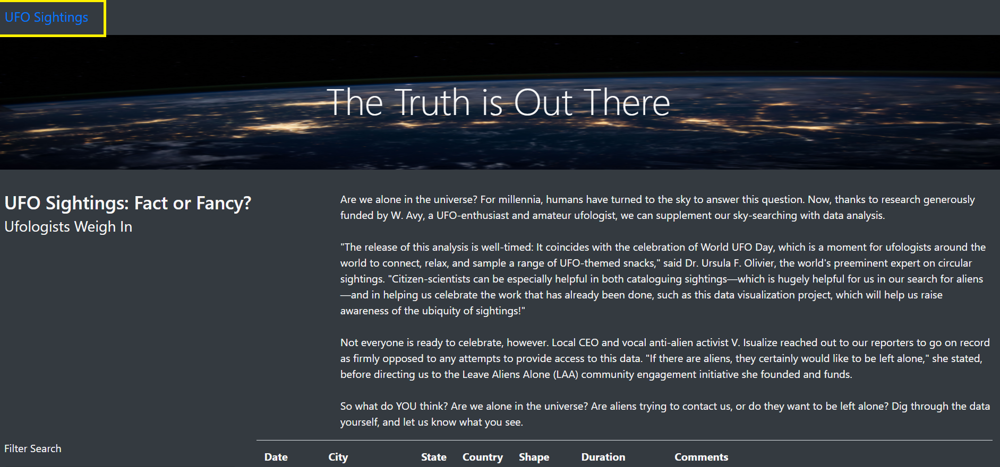
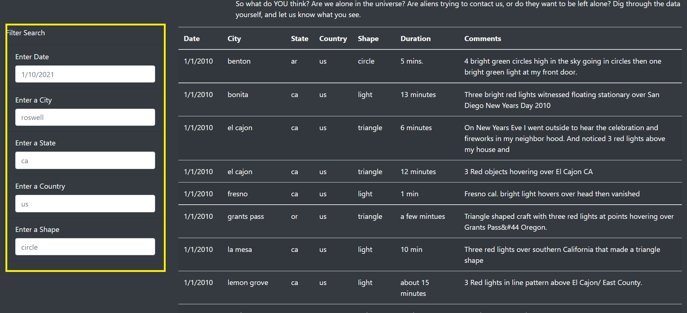

# UFOs

## Project Overview

- Build an interactive webpage that responds to user inputs and adjusts accordingly to display information about UFO sightings.
- Users will be able to filter the UFO sightings table based on multiple criteria such as date, city, state, country and shape.

## Results

Users can use the webpage following the steps described below:

1. Refresh the page by clicking on `UFO Sightings` on the navbar:
   

2. Filter by entering the interested date, the name of the city, the acronym of the state, and the shape of the UFO (**NOTE** Users don't have to enter every category to see the results; only one category is sufficient to filter the data):
   

## Summary

- Drawback for the web page: It'd be hard for the first users to know what they can type in for some of the input boxes. For example, it's not very clear what they can enter for shape (i.e., it can be any type of polygons which are many and users won't know if they can even find one they're interested in) The same applies for almost every box.
- Solution for the mentioned drawback: It'd be much more helpful if options are given in the first place in a dropdown menu. That way, users will be able to pick and choose the UFO they'd like to find out about.
- Additional suggestion: The first version of the web page had a button but this refactored one does not have one. It'd be easier for users to have it although pressing the `enter` button is probably what I would expect users to do but for a better interaction with the web page, a button that says `Filter Data` would be good.
